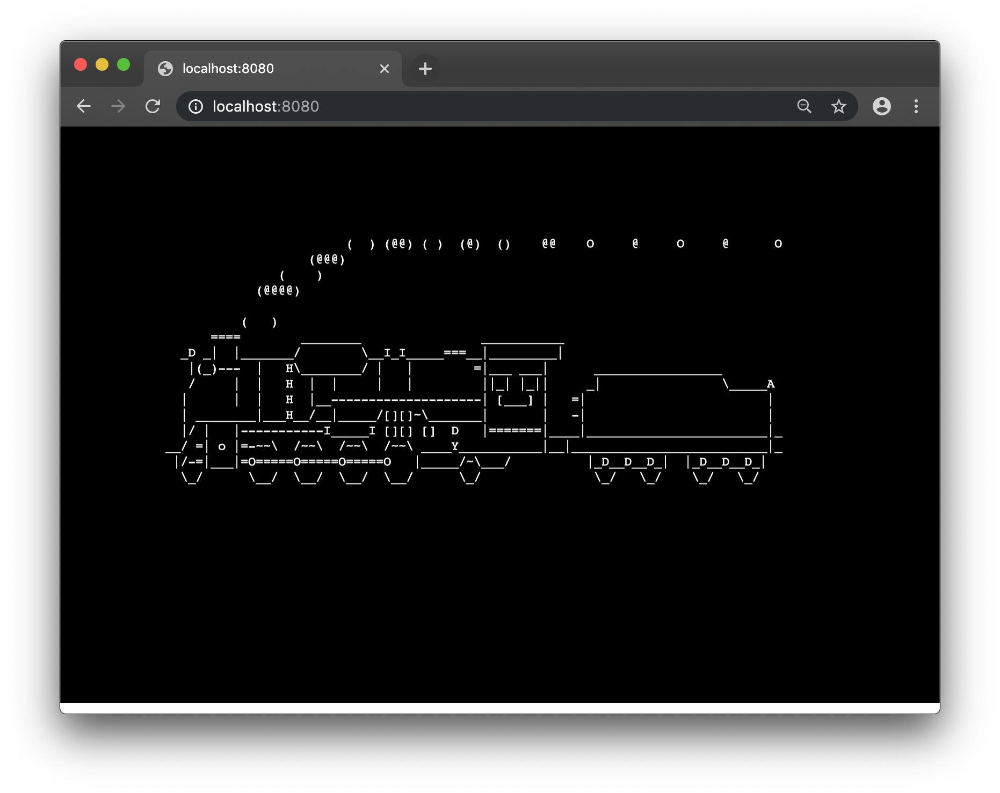

# webterm
web terminal based on xterm.js in rust



# Is it any good?
[Yes.](https://news.ycombinator.com/item?id=3067434)

# How does it work?

There is a rust backend based [Actix], consisting of two actors:
* `Websocket` implements a websocket that speaks the [Terminado] protocol
* `Terminal` handles communication to a child spawned on a PTY using [tokio-pty-process].

The frontend is a static HTML page served by [actix-web][Actix] providing an [xterm.js] UI.

[Actix]: https://actix.rs
[Terminado]: https://github.com/jupyter/terminado
[tokio-pty-process]: https://crates.io/crates/tokio-pty-process
[xterm.js]: https://xtermjs.org/

# Local development
```
cargo build
cargo run
```
Then head to `http://localhost:8080/` to see it in action!

# Should I run this on the internet?

Probably not. It lets anyone who can access the webpage control your system.
